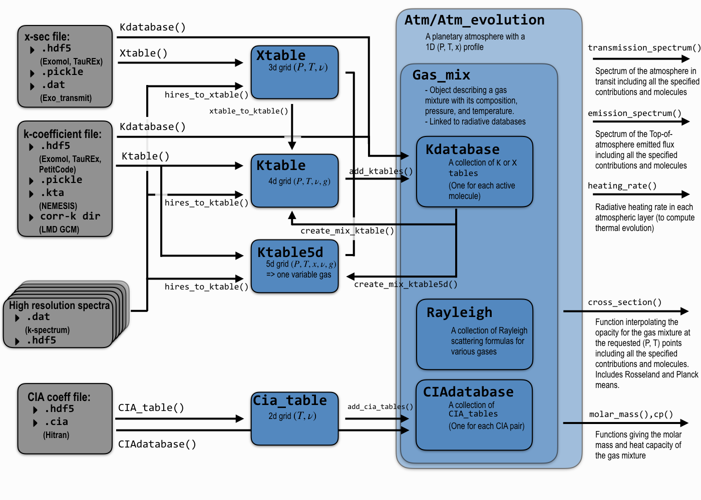

Basic principles and objects
============================

One of the main ideas of `exo_k` is to offer the possibility to easily convert radiative data
to and from many different formats. 

For this, we have created several classes that are abstract representations
of a given type of data, independently from the way these data are formatted
in the input files. 

These various structures and how to go from one to the other
(through functions written with '()') are summarized below. The list of functions is far
from exhaustive, but you can use this page to identify
a class or a function you are interested in and search
for it in the search bar or the Getting Started section.

Gray boxes depict input data files, whether they are for k-coefficients,
cross-sections, CIA data, or high resolution spectra. For the latter,
many boxes are shown because are often in many files, one per temperature and pressure point.

Classes
-------

Blue boxes represent classes in the library:

 * :class:`~exo_k.xtable.Xtable`: A class containing cross-sections for a given gas on a
   (Pressure, Temperature, wavenumber) grid.
 * :class:`~exo_k.ktable.Ktable`: A class containing cross-sections for a given gas on a
   (Pressure, Temperature, wavenumber, g-point) grid.
   
   Although both `Xtables` and `Ktables` can
   represent pure species, it can also represent mixes with variable volume mixing
   ratios, as long as these volume mixing ratios are completely determined by the
   temperature and pressure of the gas so that we do not add
   a dimension for composition to the grid
   (e.g. a gas mixture in thermo-chemical equilibrium).
 * :class:`~exo_k.ktable5d.Ktable5d`: A class containing cross-sections for a gas mixture on a
   (Pressure, Temperature, Vol. mix. ratio, wavenumber, g-point) grid. A variant from
   `Ktable`, this class represents a mixture of gases where one of the gases is free to
   vary independently (for example, a mix of N2, CO2, and CH4 in fixed quantities, with
   a free quantity of water vapor, as in Earth's atmosphere). This is often used inside
   Global Climate Models.

   The Vol. mix. ratio axis of the table stands for the vmr of the
   free gas, which is often called the *variable gas*.

 * :class:`~exo_k.cia_table.Cia_table`: A class for absorption coefficients due to Collision
   Induced Absorption given on a (Temperature, wavenumber) grid for a given CIA pair
   (e.g. H2-He, H2-H2, H2O-N2, etc.).

The classes above represent individual tables,
and these are the objects you will want to use if you want to modify a table and/or save it
to another format to be used in a different code. For the kind of modifications you can apply
to the various types of tables (binning, (P,T) remaping, mixing, etc.),
have a look at the Getting Started section. 

To obtain opacities for your gas (or gas mixture) directly from the library, you'll need to
use the following objects that are, literally, dictionaries of individual tables:

 * :class:`~exo_k.kdatabase.Kdatabase`: A dictionary containing as many
   `Ktable` or `Xtables` as you want (but not both), or a unique `Ktable5d`.
   Each table in the database is identified by the name of the gas (molecule) it describes.
   
   A :class:`~exo_k.kdatabase.Kdatabase` can be used as a stand alone to create a
   :class:`~exo_k.xtable.Xtable`, :class:`~exo_k.ktable.Ktable`, or :class:`~exo_k.ktable5d.Ktable5d`
   for a mix of gases with the random overlap method (see
   :func:`~exo_k.kdatabase.Kdatabase.create_mix_ktable()` and
   :func:`~exo_k.kdatabase.Kdatabase.create_mix_ktable5d()`).
   But is can also serve as a library of
   opacity data to be used directly for atmospheric modeling (see below).
   
   It can
   be created by adding tables one by one (:func:`~exo_k.kdatabase.Kdatabase.add_ktables()`) if you
   need to customize them beforehand, but many tables can be directly loaded from input files
   all at once with :func:`~exo_k.kdatabase.Kdatabase()`.

 * :class:`~exo_k.ciadatabase.CIAdatabase`: Idem for CIA tables and molecule pairs.
 
 * :class:`~exo_k.gas_mix.Gas_mix`: This object can be used to specify a mixture of gases
   along with its thermodynamical properties (basically, pressures, temperatures,
   and the volume mixing ratios of all the gases). This object can use the database of your
   choice to compute the radiative properties of the gas at the specified (P, T, x) points.
   This is what you will want to use if you want to directly incorporate opacities in your
   own radiative transfer code.

 * :class:`~exo_k.atm.Atm`: This object represents a planetary atmosphere with a 1D
   (P, T, composition) atmospheric profile along with data about the planet (Radius, gravity, etc.).
   This object can use the database of your
   choice to compute directly the :func:`~exo_k.atm.Atm.emission_spectrum()` or the
   :func:`~exo_k.atm.Atm.transmission_spectrum()` of your planet.
   One can also compte the radiative heating rates with :func:`~exo_k.atm.Atm.heating_rate()`.
   This class can be used to test the sensitivity of your final spectrum
   to your initial data (resolution, etc.), but also as a full fledged planetary spectrum generator.

* :class:`~exo_k.atm_evolution.atm_evolution.Atm_evolution`:
   An extension of the `Atm` class, this object now allows you to model the evolution
   of your atmosphere in time or simply to find the equilibrium thermal profile for a given
   planet knowing its composition and insolation. The atmospheric model
   includes the effect of dry convection, turbulent diffusion, and moist
   processes (condensation, moist convection, and precipitations) for any
   number of species
